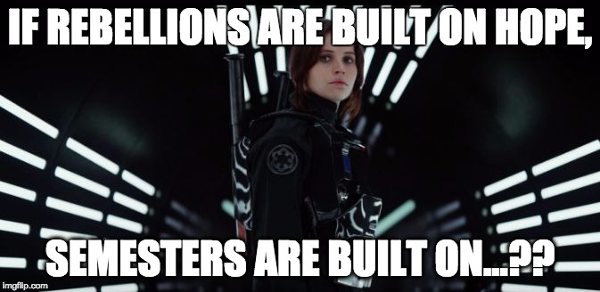
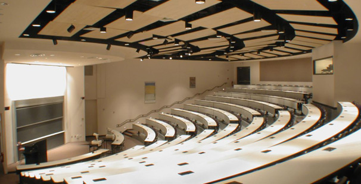
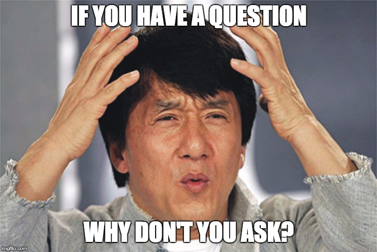
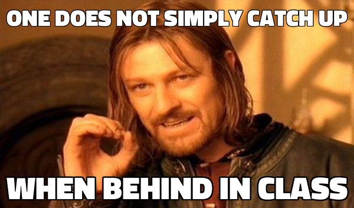

class: intro-slide

    

        <h2>CS 11114</h2>
        <h3>Introduction to Software Design</h3>
        <h4>Michael Irwin</h4>
    

    

        <h4>Events/Reminders</h4>
        

            Homework #1 due Friday @ 11:59pm 
            First Labs this week!
        

    

    

        
    

---

## Force Add Procedure

- https://www.cs.vt.edu/S17Force-Adds
- Go to our lecture - Irwin MW (1:25)
- Password: 1114msi!
- Open during only first and second lectures

---
class: middle, center

## About the Instructor

---

class: middle, center, img-65, no-print

---
class: middle, center, img-65

## About You!

---

## Course Policies/Procedures

- Using Canvas
  - Make use of the forums!
  - Forums are using Piazza, but are embedded in Canvas
  - TAs and instructors will visit them frequently
  - Do NOT post code samples to the forums
  - Don’t email me directly with questions about assignments/homework
- Office Hours
  - Me - Tue/Thur 11:30-1:30 in McB 122C
  - GTAs/TAs - posted on Canvas

---

## Course Policies/Procedures

- Labs
  - There will be about 13 sessions
  - Attend ONLY YOUR ASSIGNED lab session
  - Assignment opens at beginning of the week
  - All lab assignments close at 5:00pm on Friday
- Late Policy
  - Programming assignments - accepted up to 3 days late w/ 10% penalty each day
  - Homework and Labs - no late submissions accepted
- Grading
  - 5-6 programming assignments; 2 Tests; Final Exam
  - Lowest homework and lab grades will be dropped automatically

---

## Other Course Stuff

- Textbooks
  - Objects First with Java: A Practical Introduction using BlueJ, 6th edition
     - Will have some required readings for HW assignments
     - 5th edition has worked for students in the past
     - NOT required to purchase a copy with the access code
  - Objects First (ebooklet) - available on Canvas (free)
- Software
  - Sofia Greenfoot (download on Canvas)
  - Java JDK

---

## VT Honor Code

- Homework and programming assignments are individual assignments
  - No discussing solutions
  - No sharing code, even “just to look at it”
- No "fixing" output to match expected results
- No attempts to break Web-CAT
- During lab sessions, you can help anyone else ONLY with their lab

---
class: middle, center, inverse

# How to suceed in this class...

### (through the use of memes)

---
class: middle, center

---
class: middle, center

---
class: middle, center

---
class: middle, center

---
class: middle, center, inverse

## What is hardware? software?

---
class: middle, center, inverse

## Why do you think software design is important?

---

## We'll be learning about...

- Object-oriented coding
  - Using Java classes, interfaces, and inheritance
- Proper formatting and documentation
  - (Yes... will probably drive you crazy by the end of the semester)
- Data structures
  - Lists, maps, arrays
- Writing unit tests to validate and test code
- Debugging problems

---
class: center, middle, inverse

## Introducing the LightBot
[Textbook link](http://courses.cs.vt.edu/~cs1114/booklet/chapter1.html)

---
class: center, middle, inverse

## Questions??