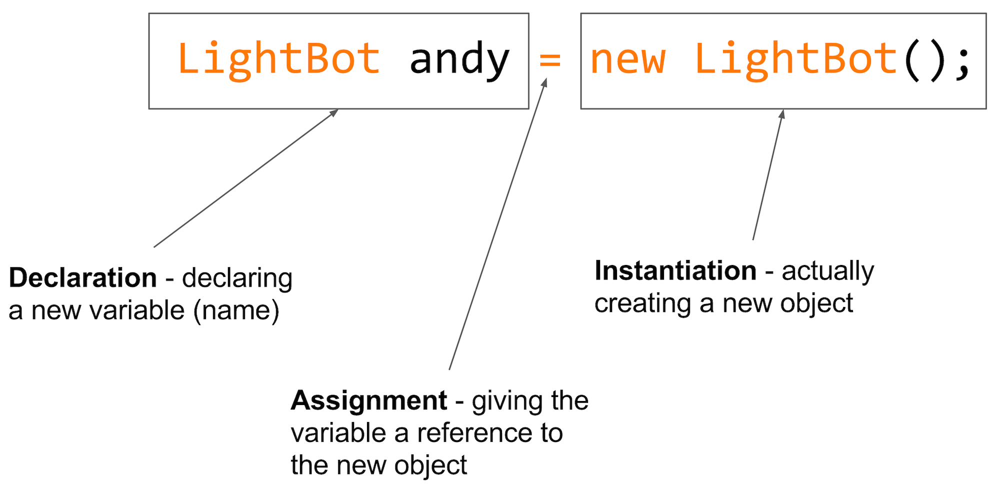

class: intro-slide

<div class="left">
    <div class="header">
        <h2>CS 11114</h2>
        <h3>Introduction to Software Design</h3>
        <h4>Spring 2017 - Michael Irwin</h4>
    </div>
    <div class="footer no-print">
        <h4><strong>Events/Reminders</strong></h4>
        <p>
            Lab 01 extended to 5:00pm today<br />
            Homework #2 (CW) due Fri 11:59pm<br />
            Program #1 due Thu, Feb 2 at 11:59pm
        </p>
    </div>
</div>
<div class="right">
    <div class="meme">
        
    </div>
</div>

---

## Force Add Procedure

- https://www.cs.vt.edu/S17Force-Adds
- Go to our lecture - Irwin MW (1:25)
- Password: 1114msi!
- Open during only first and second lectures

---
class: middle, center, img-45

## Who needs headroom?


---

class: middle, center, img-65

## Who needs privacy?


---
class: middle, center, img-35

## Something doesn't line up


---

## Creating Objects

<div class="col-xs-9 col-xs-offset-1 text-center" style="padding-top:50px;">
  
</div>

---

## Our scenario for the day...

<div class="col-xs-5 col-xs-offset-3 col-xs-push-1 text-center" style="padding-top:50px;">
  
</div>

---

## The simple way...

<div class="col-xs-8">
  <ul>
    <li>We could simply tell the bot to move four times, turn right, move four times, turn right...</li>
  </ul>

  <div class="row">
    <div class="col-xs-4 col-xs-offset-2">
      <pre style="background:#fff;color:#000">bot<span style="color:#ff7800">.</span>move();
bot<span style="color:#ff7800">.</span>move();
bot<span style="color:#ff7800">.</span>move();
bot<span style="color:#ff7800">.</span>move();
bot<span style="color:#ff7800">.</span>turnRight();


bot<span style="color:#ff7800">.</span>move();
bot<span style="color:#ff7800">.</span>move();
bot<span style="color:#ff7800">.</span>move();
bot<span style="color:#ff7800">.</span>move();
bot<span style="color:#ff7800">.</span>turnRight();
</pre>
    </div>
    <div class="col-xs-4">
      <pre style="background:#fff;color:#000">bot<span style="color:#ff7800">.</span>move();
bot<span style="color:#ff7800">.</span>move();
bot<span style="color:#ff7800">.</span>move();
bot<span style="color:#ff7800">.</span>move();
bot<span style="color:#ff7800">.</span>turnRight();


bot<span style="color:#ff7800">.</span>move();
bot<span style="color:#ff7800">.</span>move();
bot<span style="color:#ff7800">.</span>move();
bot<span style="color:#ff7800">.</span>move();
bot<span style="color:#ff7800">.</span>turnRight();
</pre>
    </div>
  </div>
</div>
<div class="col-xs-4">
  
</div>


---

## Introducing class inheritance

- Could we make our bot smarter, so he could patrol on his own? 
- Two problems with doing that…
  - Not all LightBots will patrol (cohesion)
  - We don’t have the source for `LightBot` anyways :(

```java
public class <NewClass> extends <ParentClass> {
  // New stuff goes here
}
```

- The `NewClass` will inherit all methods from `ParentClass`

---

## Making our PatrolBot

```java
public class PatrolBot extends LightBot {
  // New stuff goes here
}
```

- `PatrolBot` inherits all methods of `LightBot`, but can have its own methods
  - Example... it has methods named `move()`, `turnRight()`, `turnLeft()` 
  - We can add our own `patrolCastle()` method
- `PatrolBot` is the _child_ or _subclass_ of `LightBot`
- `LightBot` is the _parent_ or _superclass_ of `PatrolBot`


---

## Parent vs Child

<div class="col-xs-7">
  <ul>
    <li>You can view the JavaDoc for a class by switching the editor into <strong>Documentation</strong> mode.</li>
    <li>Parents are listed at top, with children branching underneath</li>
    <li>Every class in Java extends from <code class="remark-inline-code">Object</code> (don't need to explicitly extend it)</li>
  </ul>
</div>
<div class="col-xs-5">
  
</div>


---
class: inline-code-blocks

## Creating new methods

```java
public <ReturnType> <methodName>() {
  // Method body here
}
```

```java
public void patrolCastle() {
  // Method body here
}
```


- The `public` access modifier indicates anyone can call the method
  - We'll talk about other access modifiers later in the semester
- The `<ReturnType>` indicates what will be returned
  - If nothing will be returned, use `void`
- The method's name should reflect what it will do
- Don't forget to document your new methods


---

## Updating PatrolBot

- Add the `patrolCastle()` method to the `PatrolBot` and use code we wrote earlier
- Only change... it's no longer `bot.move()`, but simply `move()`. Why??

```java
public void patrolCastle() {
  move();
  move();
  move();
  move();
  turnRight();

  move();
  move();
  move();
  move();
  turnRight();

  // Walk the wall two more times...
}
```


---
class: right-align-code-block

## Making it cleaner

```java
public class PatrolBot extends LightBot {
  
  /**
   * Perform a single patrol around the castle
   */
  public void patrolCastle() {
    walkOneWall();
    walkOneWall();
    walkOneWall();
    walkOneWall();
  }

  public void walkOneWall() {
    move();
    move();
    move();
    move();
    turnRight();
  }

}
```

- Created a helper method named `walkOneWall`. It’s also `public`, so can be invoked from outside the `PatrolBot`.

