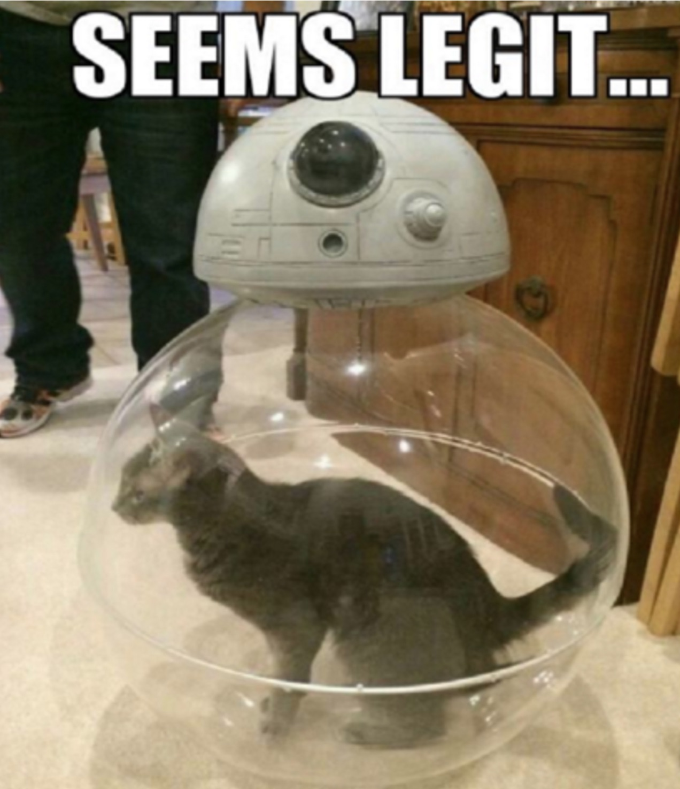
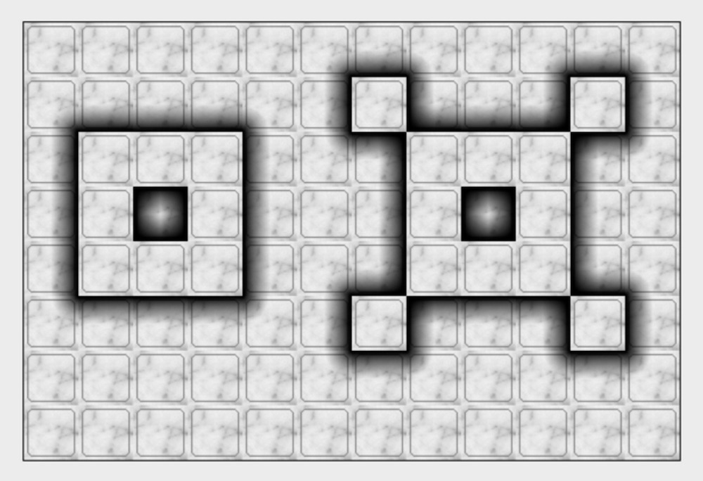

class: intro-slide

<div class="left">
    <div class="header">
        <h2>CS 11114</h2>
        <h3>Introduction to Software Design</h3>
        <h4>Spring 2017 - Michael Irwin</h4>
    </div>
    <div class="footer no-print">
        <h4><strong>Events/Reminders</strong></h4>
        <p>
            Lab 02 due Friday at 5:00pm<br />
            Homework #2 (CW) due Fri 11:59pm<br />
            Program #1 due Thu, Feb 2 at 11:59pm
        </p>
    </div>
</div>
<div class="right">
    <div class="meme">
        
    </div>
</div>

---

## Things to know...

- Don't forget to fully extract the ZIP file for scenarios (lab, assignments, etc.)
- When you make a new world subclass (Lab 2), tell Greenfoot to use it
  - Right-click on the **Lab02Solution** box and hit **new Lab02Solution()**
  - Clicking the **Run** button will then invoke the `myProgram()` method in the Lab02Solution

---

## Today's Scenario

<div class="pull-right" style="width:500px;margin-left:50px;">
  
</div>

Our castle has gotten an upgrade by adding turrets to the corners!

How do we patrol this new castle?


---
class: inline-code-blocks

## A modified `PatrolBot`

- `walkOneWall` will now delegate to a new method that will actually turn the corner
- Today's lecture scenario starts with this refactor already completed

```java
public void walkOneWall() {
    this.move();
    this.move();
    this.turnCorner();
}

public void turnCorner() {
    this.move();
    this.turnRight();
    this.move();
}
```

---

## Let's make a new bot!

- Rather than updating the `PatrolBot`, let's make another specialized bot that can work with the turrets

```java
public class TurretBot extends PatrolBot {
    // New stuff will go here
}
```

- The new `TurretBot` will inherit all methods from the `PatrolBot`, including the new `turnCorner` method


---

## Overriding methods

- Overriding methods allows a subclass to change the behavior of a method defined in a parent class
- To override a method, the method must:
  - Have the same return type (`void` for our methods so far)
  - Have the same name
  - Have the same arguments (none for our methods so far)

```java
public class TurretBot extends PatrolBot {
    public void turnCorner() {
        // This will be invoked
    }
}
```

---

## The updated `turnCorner`

- Putting this into the `TurretBot`, it should now patrol around the castle

```java
public void turnCorner() {
    turnLeft();
    move();
    turnRight();
    move();
    move();
    turnRight();
    move();
    move();
    turnRight();
    move();
    turnLeft();
}
```

---

## Hmm... something looks familiar here...

```java
public void turnCorner() {
    turnLeft();

    move();   // Original turnCorner from LightBot
    turnRight();
    move();
    
    move();   // Original turnCorner again
    turnRight();
    move();
    
    move();   // And again...
    turnRight();
    move();
    
    turnLeft();
}
```


---

## Introducing `super`

- The `super` keyword allows us to invoke methods on a parent class
- Used quite frequently when overriding methods (you'll get practice with it)

```java
public void turnCorner() {
    turnLeft();
    super.turnCorner();
    super.turnCorner();
    super.turnCorner();
    turnLeft();
}
```


---

## Polymorphism

> Polymorphism allows the expression of some sort of contract, with potentially many types implementing that contract (whether through class inheritance or not) in different ways, each according to their own purpose. Code using that contract should not have to care about which implementation is involved, only that the contract will be obeyed."
> - http://stackoverflow.com/a/409982/502139

```java
// What's going to happen here?
PatrolBot bot = new TurretBot();
bot.turnCorner();
```

--

#### The TurretBot's `turnCorner` method is invoked!!


---

#### Minds blown?

<div class="row text-center">
  
  
  
  
  
</div>

---

## Why was TurretBot's `turnCorner` invoked?

```java
PatrolBot bot = new TurretBot();
bot.turnCorner();
```

- The first statement creates a variable named `bot` with a type of `PatrolBot`
  - Anything that is assigned to `bot` MUST be a `PatrolBot`
  - Statement is valid because all `TurretBot`s are `PatrolBot`s
- When we invoke a method on `bot`, it's using the code on the assigned object
  - In this case, it's invoking the `turnCorner` method on the `TurretBot`
  
