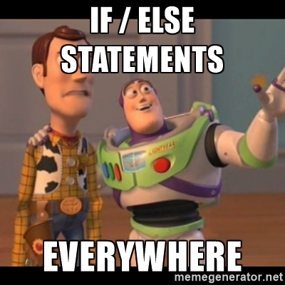
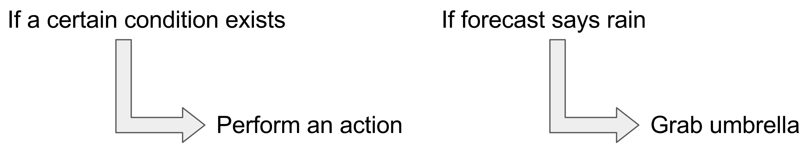
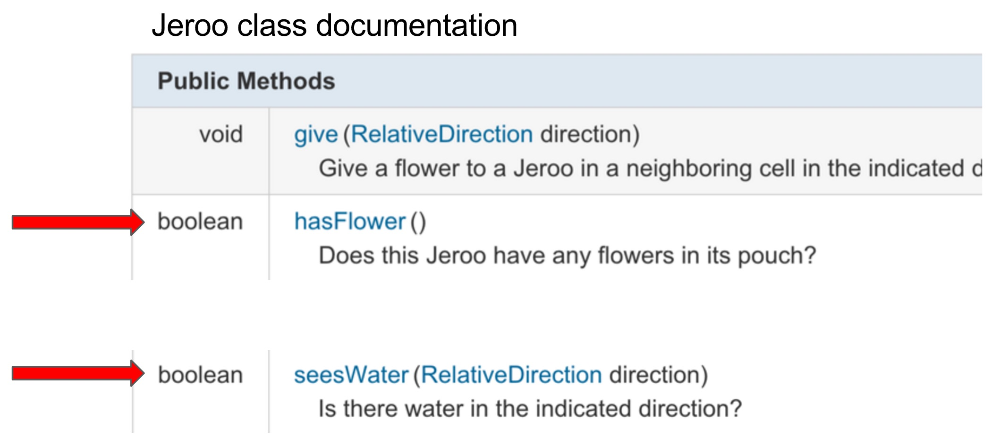
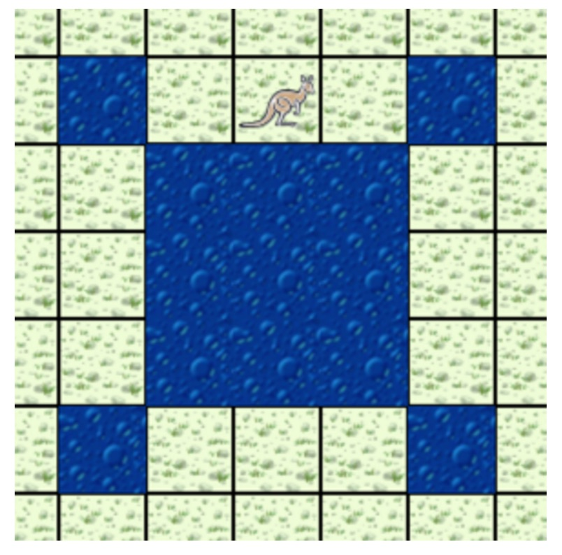
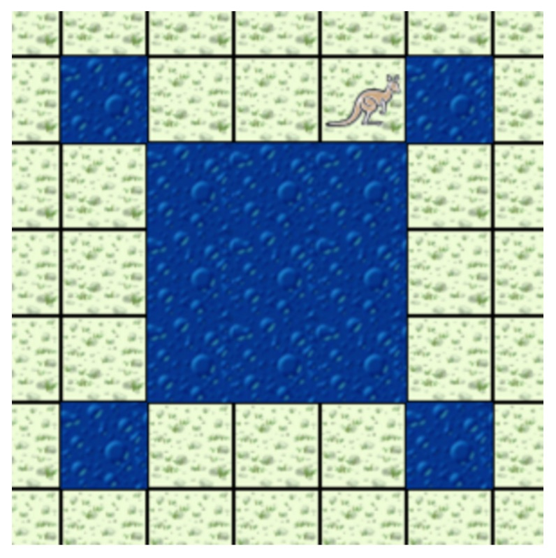
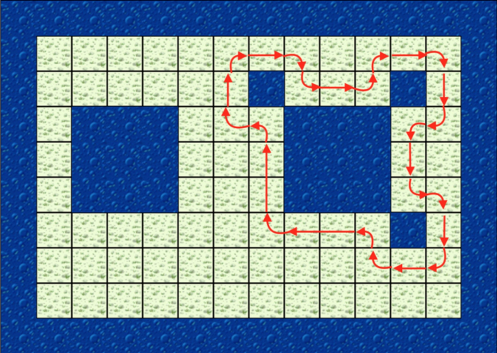

class: intro-slide

<div class="left">
    <div class="header">
        <h2>CS 11114</h2>
        <h3>Introduction to Software Design</h3>
        <h4>Spring 2017 - Michael Irwin</h4>
    </div>
    <div class="footer no-print">
        <h4><strong>Events/Reminders</strong></h4>
        <p>
            Homework #2 (CW) due tonight<br />
            Lab 03 due Friday at 5:00pm<br />
            Homework #3 (reading) due Wed night<br />
            Program #1 due Thu, Feb 2 at 11:59pm
        </p>
    </div>
</div>
<div class="right">
    <div class="meme">
        
    </div>
</div>

---
class: center, middle, inverse

## Program #1

---

## Making Decisions

- We make decisions everyday based on input
    - If the forecast says it’s going to rain, I will grab my umbrella
    - If my laptop is low on power, I will plug it in
- In simple cases, there's a pattern to the decision...




---
class: inline-code-blocks

## Representing Decisions in Code

- In code, we use an **if statement**
- The conditional statements must evaluate something to be **true** or **false**
  - Boolean methods
  - Boolean expressions

```java
if (<conditional statement>) {
  // actions go here
}
```

```java
if (willRainToday()) {
  grabUmbrella();
}
```


---

## Boolean Methods

- A **boolean** is a primitive type that has two values - **true** or **false**
- A **boolean method** is a method that returns a boolean




---
class: inline-code-blocks

## Boolean Method Examples

<div class="pull-right">
    
</div>


- What's the return value for the method below?

```java
jeroo.seesWater(AHEAD);
```

--

- The return would be `false` because there is no water ahead of the Jeroo


---
class: inline-code-blocks

## Boolean Method Examples, #2

<div class="pull-right">
    
</div>


- How about now?

```java
jeroo.seesWater(AHEAD);
```

--

- The return would be `true` because there IS water ahead of the Jeroo


---

## Our Scenario

<div class="pull-right">
    
</div>

- The neighboring enemy destroyed one of our turrets!  
- Need to make our `TurretJeroo` (or bot) more flexible so it can patrol the most optimized route
- What's our algorithm?


---
class: right-align-code-block

## The Algorithm

```java
public void turnCorner() {
    if (!seesWater(AHEAD)) {
        super.turnCorner();
    }
    if (seesWater(AHEAD)) {
        this.turn(LEFT);
    
        super.turnCorner();
        super.turnCorner();
        super.turnCorner();
            
        this.turn(LEFT);
    }
}
```

- If we don’t see water ahead...<br />
      &nbsp; &nbsp;do a normal corner turn
- If we do see water ahead...<br />
      &nbsp; &nbsp;do our custom turret turn


---
class: right-align-code-block, inline-code-blocks

## Refining the Algorithm

```java
public void turnCorner() {
    if (seesWater(AHEAD)) {
        this.turn(LEFT);
    
        super.turnCorner();
        super.turnCorner();
        super.turnCorner();
            
        this.turn(LEFT);
    }
    else {
        super.turnCorner();
    }
}
```

- Using an `if-else` statement, we can make the <br />code even cleaner

<br />
 
```java
if (<conditional statement>) {
  // actions if condition is true
}
else {
  // actions if condition is false
}
```