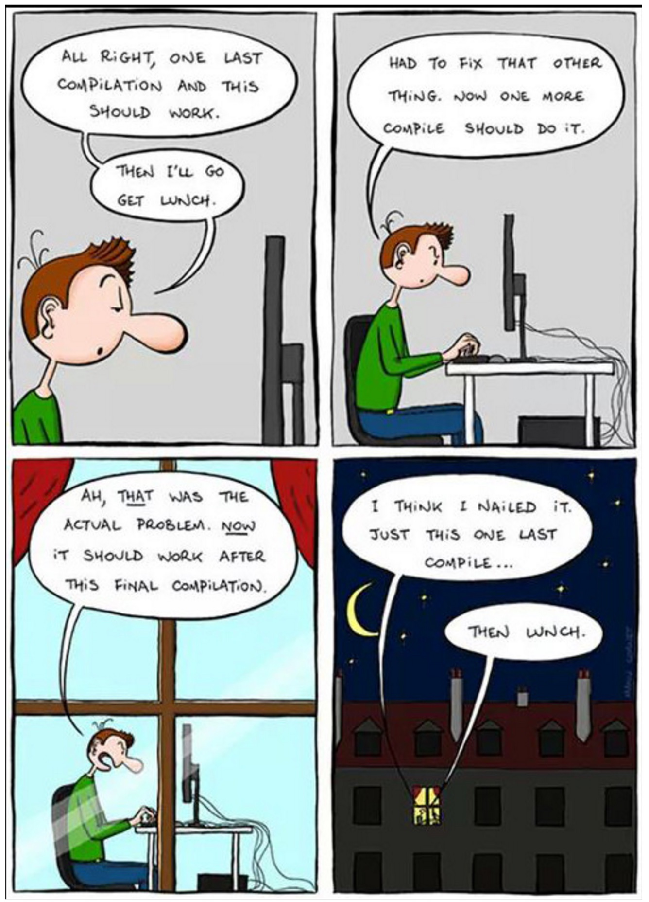
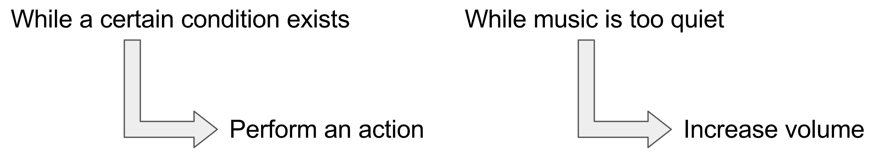
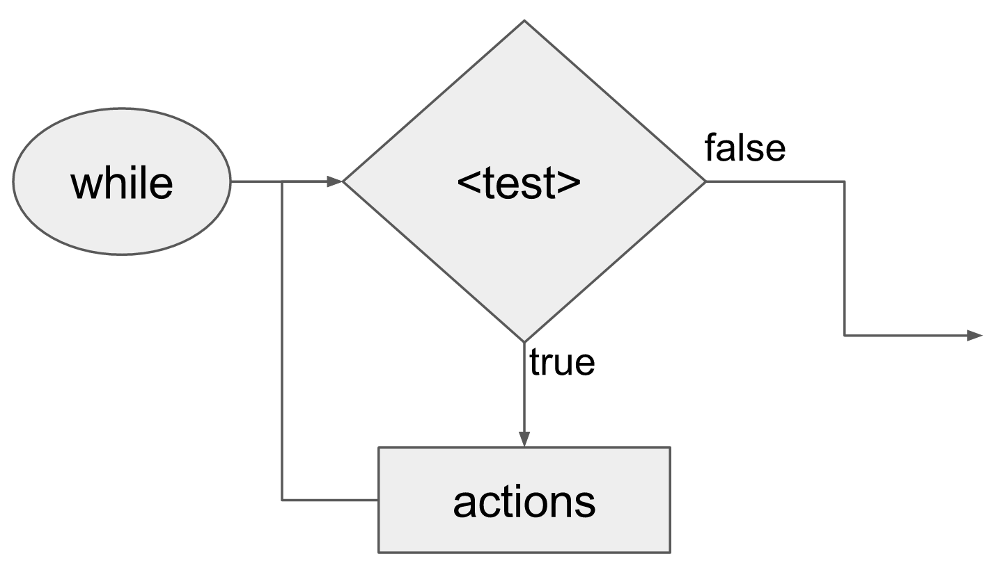
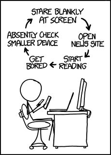
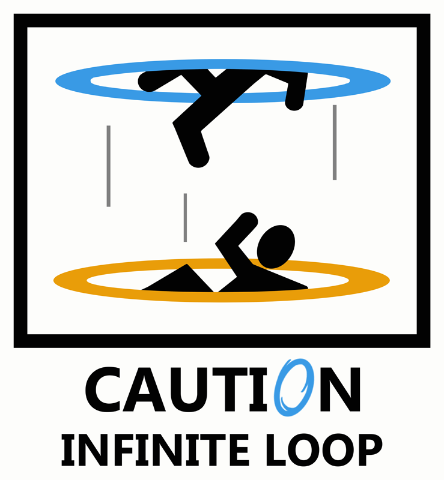
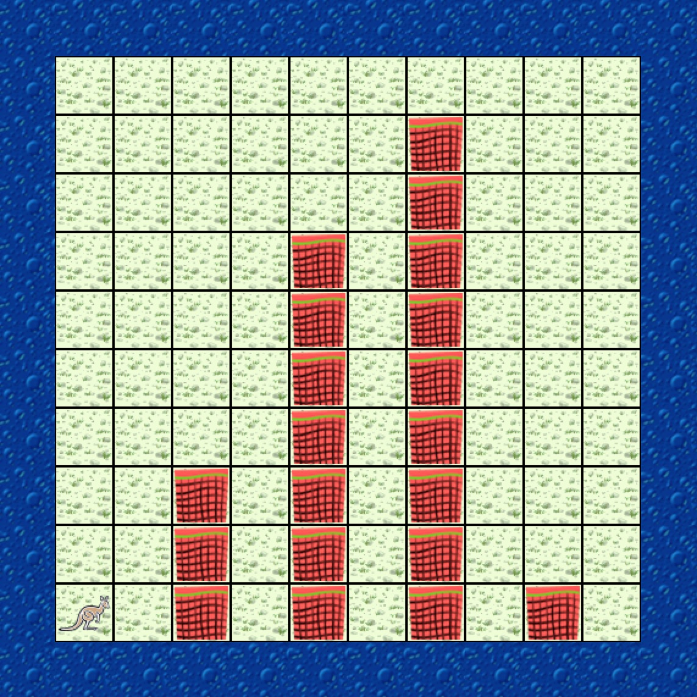

class: intro-slide

<div class="left">
    <div class="header">
        <h2>CS 11114</h2>
        <h3>Introduction to Software Design</h3>
        <h4>Spring 2017 - Michael Irwin</h4>
    </div>
    <div class="footer no-print">
        <h4><strong>Events/Reminders</strong></h4>
        <p>
            HW #3 (reading) should be done tonight<br />
            Program #1 due <strong>tomorrow</strong> at 11:59pm<br />
            Lab 03 due Friday at 5:00pm<br />
        </p>
    </div>
</div>
<div class="right">
    <div class="meme">
        
    </div>
</div>

---
class: center, middle, inverse

## Program #1

---

## Performing Repetitive Tasks

- We make repeating decisions everyday based on input
  - If the music is too quiet, turn up the volume
  - If I don't feel ready for a test, keep studying
- Computers are designed to easily repeat tasks
  - Humans easily get bored, sidetracked, or lost in the process



---
class: inline-code-blocks

## Representing While Loops in Code

- There are two main types of loops
  - `while` loops
  - `for` loops (we’ll talk about in a future lecture)
- The recipe...
  - Starts with reserved word `while`
  - Parentheses surround the test (same as `if` statements)
  - Actions surrounded by braces

<br />

```java
while (<conditional test>) {
  // actions go here
}
```

```java
while (musicTooQuiet()) {
  increaseVolume();
}
```


---
class: inline-code-blocks

## How's it work?

1. Loop starts by evaluating the `<test>`
2. If `<test>` is true, execute the actions. Go back to step 1
3. If `<test>` is false, skip over actions

<br />

<div class="pull-right">
    
</div>


```java
while (<test>) {
    // actions go here
}
```


---

## Building a while loop

1. Figure out what must be true to finish looping
2. Define a test that is the opposite of Step 1’s condition
3. Within the `while` loop body, make progress towards the goal


---

## Looping errors

- What's wrong with the code snippet below?

```java
while (this.isFacing(NORTH)) {
    this.hop();
    this.pick();
}
```

--

It's an **infinite loop**!


---
class: middle, center, img-55


---
class: middle, center




---
class: middle, center, img-55



---
class: middle, center


---
class: middle, center, inverse

## Don't get stuck in infinite loops!
### Make progress towards the goal


---

## Today's Scenario

<div class="pull-right">
    
</div>

- We have a world that creates random "hurdles"
- Want to make our `Jeroo` smart enough to hop "over" the hurdles
- Scenario ZIP has TODO comments to provide hints
