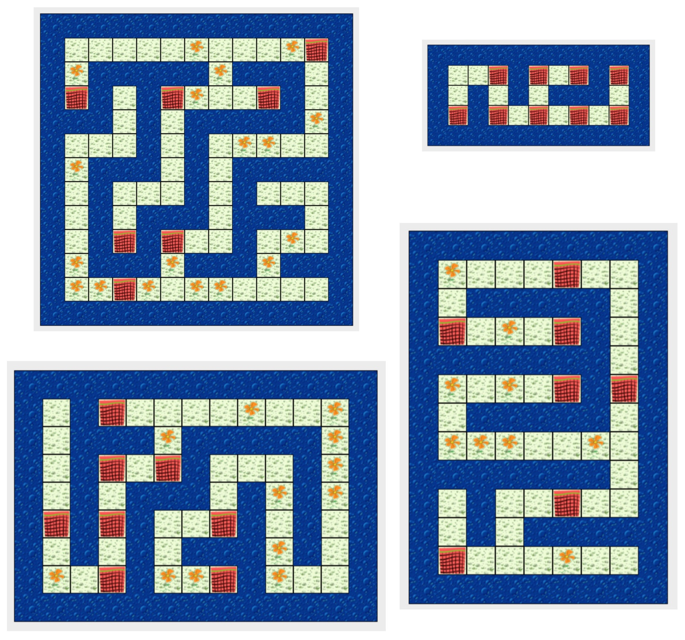

class: intro-slide

<div class="left">
    <div class="header">
        <h2>CS 11114</h2>
        <h3>Introduction to Software Design</h3>
        <h4>Spring 2017 - Michael Irwin</h4>
    </div>
    <div class="footer no-print">
        <h4><strong>Events/Reminders</strong></h4>
        <p>
            Homework #4 (reading/quiz) due Wed night<br />
            Lab 4 this week<br />
            Program 2 due next Thursday
        </p>
    </div>
</div>
<div class="right">
    <div class="meme">
        
    </div>
</div>

---
class: center, middle, inverse

## Introducing Program #2!

---

class: center, middle


---

## Program #2

<div class="pull-right">
    
</div>

- Due Thursday next week
- Goals:
   - Pick up all flowers
   - Remove all nets
   - Jeroo stops in bottom-right corner
- A random layout is used each time
- Think of your "walking the maze" strategy
- Will need to write tests to prove your Jeroo works (in next lecture)

---

## Program #2 Tips

- You will need a loop in `myProgram` to run until you're done
   - When are you done? (see previous slide)
   - What's the opposite of that condition?
   - How do you actually code it?
- Make progress in your `while` loop
   - As mentioned in the spec, choose one preferred direction and stick to it

---

## What is a boolean operator?

- First of all, what’s an operator?
  - Simply performs a function on a value to (possibly) get a new value
- In math, what operators do you use?
  - Hint... addition, subtraction, multiplication, division, etc.
- When working with booleans, what changes can we make?


---

## You already know one operator!

- `not (!)` is a unary prefix operator
  - unary - a single value being modified
  - prefix - appears before the value
- Simply says to turn the boolean into its opposite value<br />
  `!true    =>  false`<br />
  `!false   =>  true`

---
class: inline-code-blocks

## More legible code using equivalent conditions

- Make sure your code is written to be easy to understand
- For if/else statements, starting with a ! _usually_ makes code harder to read
- Invert the condition (and body) to make it easier to read

<br />

```java
if (!isClear(AHEAD)) {
    jumpHurdle();
}
else {
    hop();
}
```

```java
if (isClear(AHEAD)) {
    hop();
}
else {
    jumpHurdle();
}
```


---

## More complex operators

- In many cases, decisions aren't based on a single input
- Two new boolean operators - `and` and `or`
- `and` - **both** conditions must be true
    - If it's going to rain and the umbrella's indoors, grab the umbrella
    - If the music is too quiet and not at max, increase volume
- `or` - **one** of the conditions must be true
    - If it's raining now or going to rain later, grab umbrella

---

## Using `and`/`or` in code

- `and`/`or` are called binary infix operators
  - binary - two values in question
  - infix - placed between each value
- `and` is represented by `&&`
  - `goingToRain() && umbrellaIndoors()`
  - `musicTooQuiet() && !volumeAtMax()`
- `or` is represented by `||`
  - `rainingNow() || goingToRain()`


---

## Order of Operations

- Just as in normal math, there’s an order of operations

1. `()`  -  works from innermost to outermost
2. `!`   -  negation operators then evaluated
3. `&&`  -  AND operators are then evaluated
4. `||`  -  OR operators evaluated last


---

## Today's Scenario

<div class="pull-right">
    
</div>

- Our Jeroo needs to clean up the island
- Need to fill in the `CleaningJeroo`'s `cleanUpTheIsland` method
  - How do we know we're done?
  - What's the opposite?
  - How do we make progress?