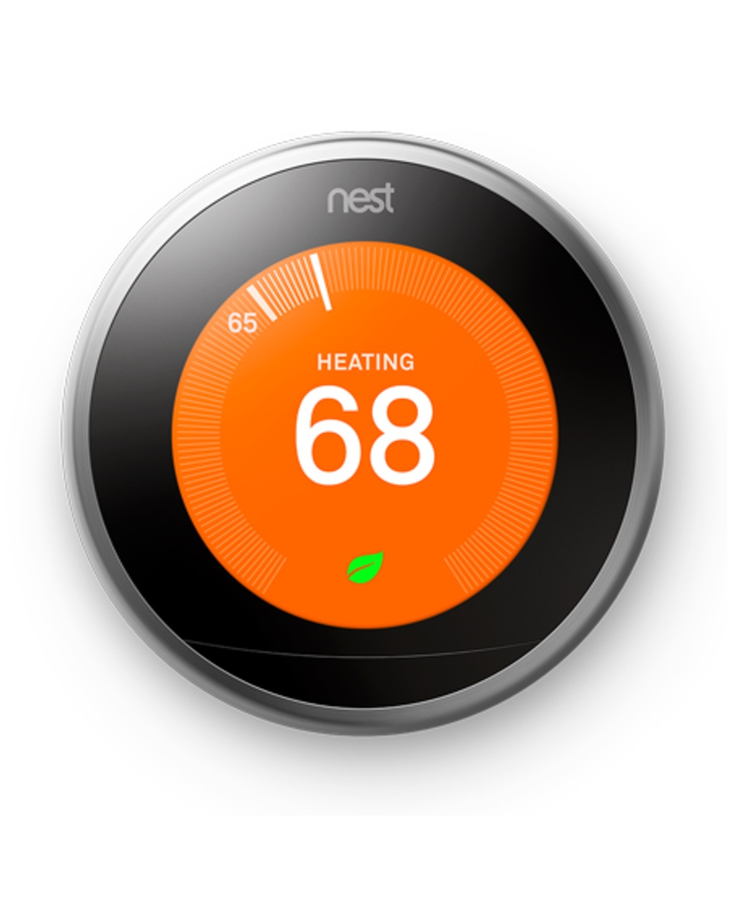
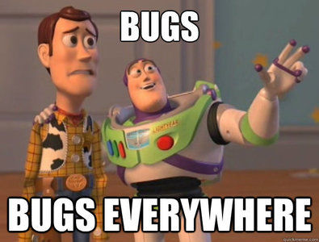
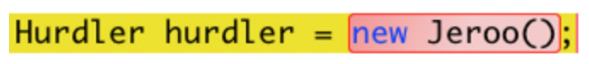
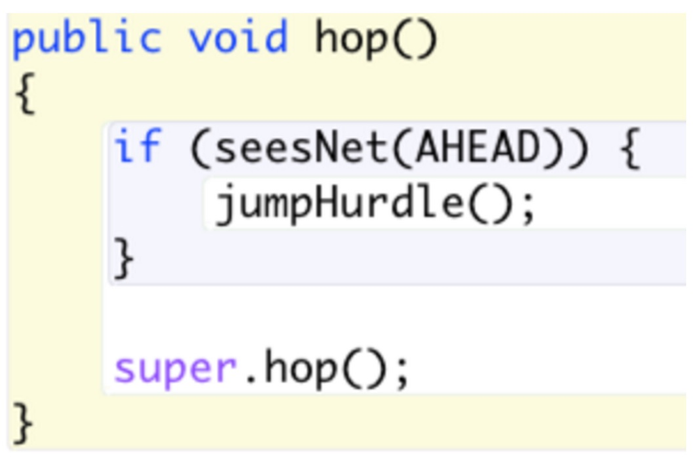
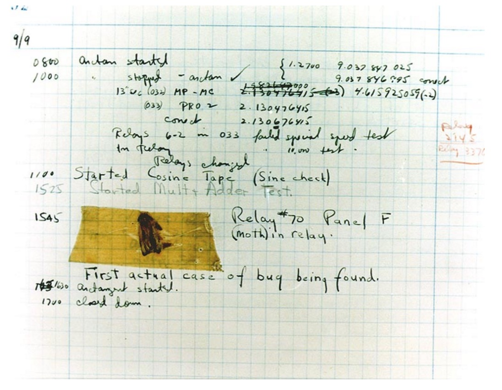
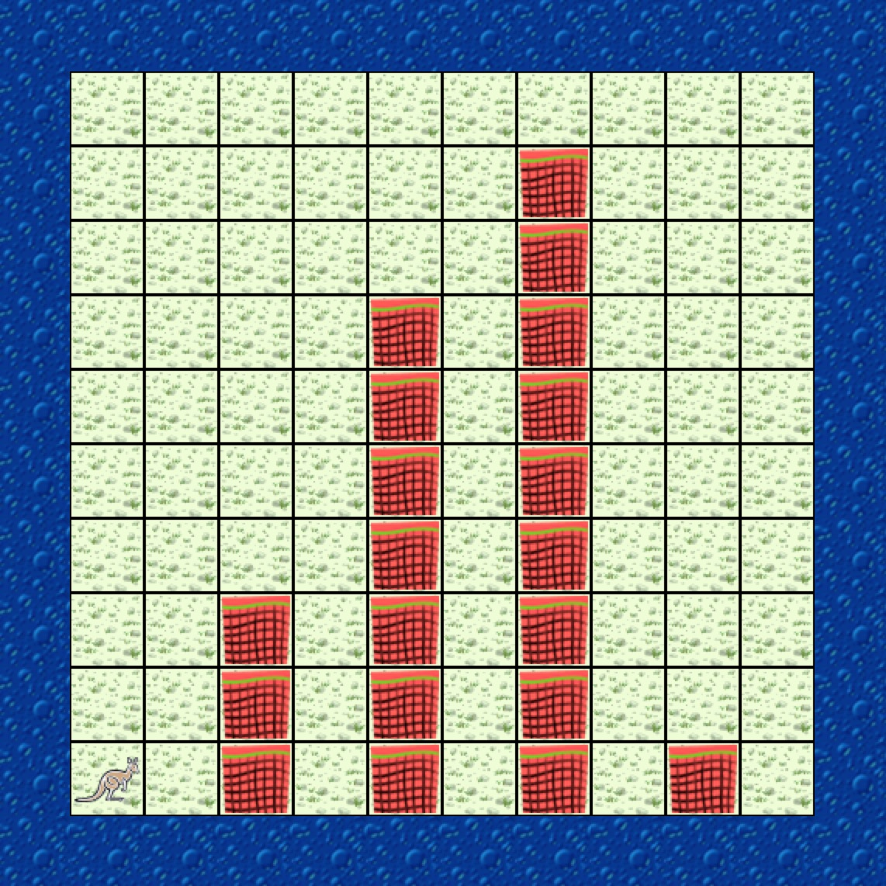

class: intro-slide

<div class="left">
    <div class="header">
        <h2>CS 11114</h2>
        <h3>Introduction to Software Design</h3>
        <h4>Spring 2017 - Michael Irwin</h4>
    </div>
    <div class="footer no-print">
        <h4><strong>Events/Reminders</strong></h4>
        <p>
            Homework #4 (reading/quiz) due tonight<br />
            Lab 4 this week<br />
            Program 2 due next Thursday
        </p>
    </div>
</div>
<div class="right">
    <div class="meme">
        
    </div>
</div>

---
class: center, middle, inverse

## How's Program #2?

---

## Software Bugs!

<div class="col-md-4">
    
</div>

--

<div class="col-md-4" style="padding-top:50px;">
    
</div>

--

<div class="col-md-4" style="padding-top:50px;">
    
</div>


---
class: middle, center




---

## Error Types

- **Syntax errors** - invalid characters, commands, or instructions
  - Spotted by the compiler
- **Logic errors** - problems that cause intended outcomes or behaviors
  - Often referred to as **bugs**
  - NOT caught by a compiler. Caught by testing or users

<div class="col-md-5 col-md-offset-1" style="padding-top:80px;">
    
</div>

<div class="col-md-5">
    
</div>


---

## Testing vs Debugging

<div class="pull-right" style="margin-top:100px;margin-left:50px;">
    
</div>

- **Testing** - by writing tests, we search for the **presence** of errors
  - Should be done by developers
- **Debugging** - look for the **source** of an error
  - Often done by maintainers
  - Many times, the root cause is far from where you see the error


---

## Unit Testing

- Testing specific units of code (method, lines, classes)
- Should be done during development
- **Validates the contract** (sound familiar) - does it do what it should?
  - If we call `hop()`, does the Jeroo move one space?
  - If we call `turn(RIGHT)` when facing east, does the Jeroo end up facing south?
- Test the boundaries (zero, one, full)
  - If I call `add(jeroo, 15, 15)` when the world is only 12x12, what happens?
  - If I call `add(jeroo, 8, 8)`, but something’s there, what happens?

---

## Testing Terminology

- **Test case** - an individual test for a specific behavior/unit
  - Written as a single method in a test class
- **Claim/assertion** - a statement expressing the expected behavior/outcome
  - Placed within test cases. A single test case can make several claims/assertions
- **Test fixture** - the collection of initial conditions used in one or more cases
  - Setup performed before tests are actually run


---

## Testing Recipe

1. Setup the test
   - Create initial conditions
2. Perform actions
   - Each test case should perform a separate action/condition
3. Make assertions
   - Validate that the actions had the expected outcomes


---

## Test assertions

- Assertions are used to validate behavior
- `assertEquals(expected, actual)` - validate `expected` and `actual` are equal
- `assertTrue(actual)` - validates that `actual` is true
- `assertFalse(actual)` - validates that `actual` is false

<br />
```java
public void testHop() {
    world.add(hurdler, 2, 5);

    hurdler.turnCorner();

    assertEquals(4, hurdler.getGridX());
    assertEquals(5, hurdler.getGridY())
    assertTrue(hurdler.isFacing(SOUTH));
    assertFalse(hurdler.hasFlower());
}
```


---

## Designing Tests

<div class="pull-right">
    
</div>

- What do we need to test?
  - Hint - we can test each of the new methods we added to the Hurdler
- What are the various conditions we should test?


---
class: middle, center, inverse

# Let's write some tests!
### I know you're excited, huh?