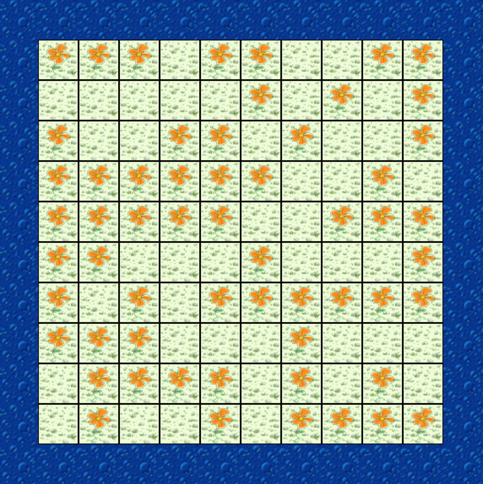

class: intro-slide

<div class="left">
    <div class="header">
        <h2>CS 11114</h2>
        <h3>Introduction to Software Design</h3>
        <h4>Spring 2017 - Michael Irwin</h4>
    </div>
    <div class="footer no-print">
        <h4><strong>Events/Reminders</strong></h4>
        <p>
            Homework #5 (reading/CW) due Wed night<br />
            Lab 5 this week<br />
            Program 2 due Thursday
        </p>
    </div>
</div>
<div class="right">
    <div class="meme">
        
    </div>
</div>

---
class: center, middle, inverse

## How's Program #2?

---

## Class Structure

- **Fields** - store values/data for an object
- **Constructors** - used to initialize/setup the class
- **Methods** - operations/behaviors the class exposes

<br />

```java
public class LazyCleaningJeroo extends CleaningJeroo {
    // Fields
    // Constructors
    // Methods
}
```


---
class: inline-code-blocks

## Fields

- Also known as **instance variables**
- Define the _state_ of the object
- Values can change frequently, or rarely

<br />

```java
public class LazyCleaningJeroo extends CleaningJeroo {
    private int numFlowersCollected;
    private int numFlowersAllowed; 

    // Other methods go here
}
```

---
class: right-align-code-block, code-mt-0, code-ml-50

## Setting Fields using Constructors

```java
public class LazyCleaningJeroo extends CleaningJeroo {
    private int numFlowersCollected;
    private int numFlowersAllowed;
 
    public LazyCleaningJeroo(int flowerLimit) {
        this.numFlowersAllowed = flowerLimit;
        this.numFlowersCollected = 0;
    }
}
```

- Constructors are perfect place to set up or initialize an object
- Recipe for a constructor
  - Have same name as the class
  - No return type
- Can setup fields not passed as parameters

---
class: right-align-code-block, code-mt-0, code-ml-50

## Retrieving Field State using Methods

```java
public class LazyCleaningJeroo extends CleaningJeroo {
    private int numFlowersCollected;
    private int numFlowersAllowed;
 
    public LazyCleaningJeroo(int flowerLimit) {
        this.numFlowersAllowed = flowerLimit;
        this.numFlowersCollected = 0;
    }

    public int getNumFlowersAllowed() {
        return numFlowersAllowed;
    }

    public int getNumFlowersCollected() {
        return numFlowersCollected;
    }
}
```

- Methods can be used to get the current state of an object
- Commonly called a **getter**
- Can also use the inspector in Greenfoot


---
class: inline-code-blocks

## Why they're called instance variables...

```java
public class LazyCleaningJeroo 
        extends CleaningJeroo {
    private int numFlowersCollected;
    private int numFlowersAllowed;
 
    public LazyCleaningJeroo(int flowerLimit) {
        this.numFlowersAllowed = flowerLimit;
        this.numFlowersCollected = 0;
    }

    public int getNumFlowersAllowed() {
        return numFlowersAllowed;
    }

    public int getNumFlowersCollected() {
        return numFlowersCollected;
    }
}
```

```java
LazyCleaningJeroo jeroo1 = new LazyCleaningJeroo(10);
LazyCleaningJeroo jeroo2 = new LazyCleaningJeroo(25);

jeroo1.getNumFlowersAllowed();
    // returns 10

jeroo2.getNumFlowersAllowed();
    // returns 25
```

---

## Updating Field State using Methods

- Methods can be used to update the current state of an object
- If simply setting, called a **setter**

<br />

```java
public class LazyCleaningJeroo extends CleaningJeroo {
    private int numFlowersAllowed;

    // ...

    public void setNumFlowersAllowed(int numAllowed) {
        this.numFlowersAllowed = numAllowed;
    }

}
```

---

## Problem Scenario

<div class="pull-right">
    
</div>

- Let's actually code `LazyCleaningJeroo`, who will only pick up flowers 1-_N_ where _N_ is the limit we specify
- Then, write tests for it!

