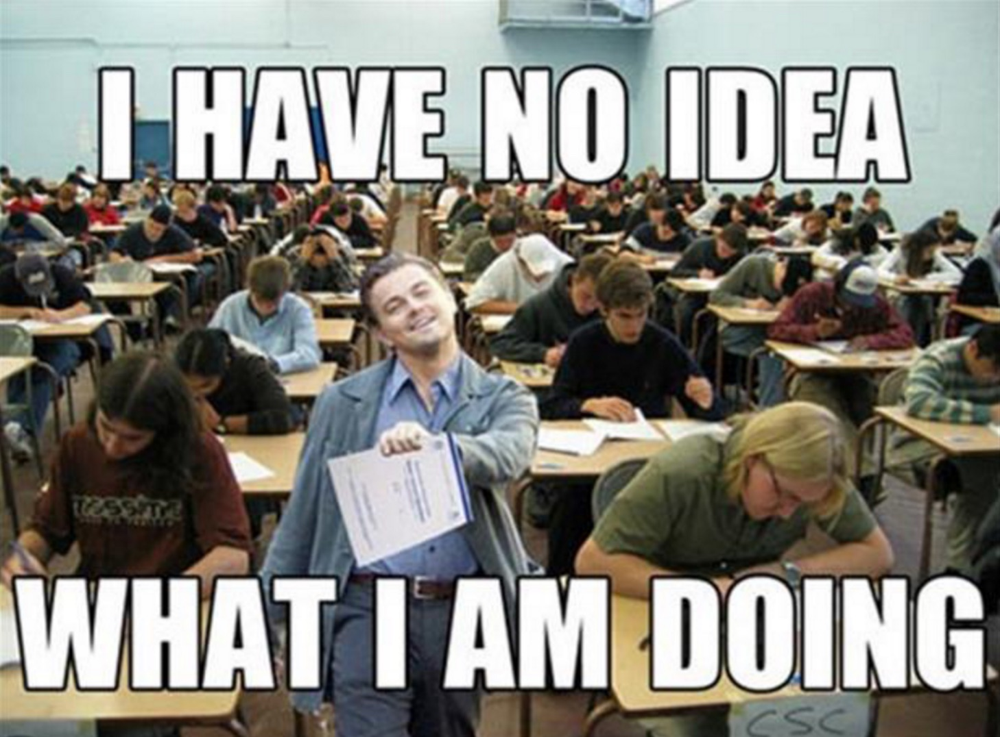
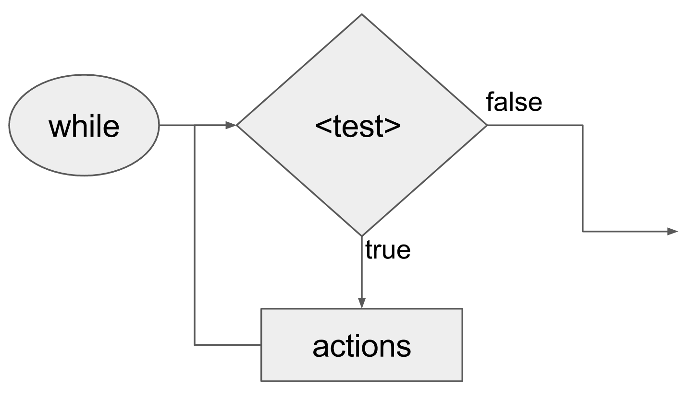

class: intro-slide

<div class="left">
    <div class="header">
        <h2>CS 11114</h2>
        <h3>Introduction to Software Design</h3>
        <h4>Spring 2017 - Michael Irwin</h4>
    </div>
    <div class="footer no-print">
        <h4><strong>Events/Reminders</strong></h4>
        <p>
            HW 5 (reading/CW) due tonight<br />
            Lab 5 this week<br />
            Test 1 on Monday
        </p>
    </div>
</div>
<div class="right">
    <div class="meme">
        
    </div>
</div>

---
class: center, middle, inverse

## How's Program #2?

---

## Test Format

- 12 quiz-style questions on Canvas
  - Multiple choice, short answer, true/false
- 2 questions on CodeWorkout
  - Expect to write a method that uses an if-then-else
  - Expect to write a method that uses a while loop


---

## Basic Object-Oriented Terms

- Class
- Object 
  - What's the difference between a class and an object?
- Methods
- Inheritance
  - Which is the parent/superclass?
  - Which is the child/subclass?
  - How do you inherit from a class?

---
class: right-align-code-block, code-mt-0

## Polymorphism

```java
public class Hurdler extends Jeroo {
  public void hop() {
    if (this.seesNet(AHEAD)) {
      hurdleNet();
    }
    else {
      super.hop();
    }
  }

  public void hurdleNet() {
    // Hurdling went here
  }
}
```

- What does it mean?
- Can you give an example?
- What is _method overriding_?
- What do `super` and `this` mean?


---

## Writing Methods

- What's need to write a method?
- How to call/invoke a method
- Difference between `super` and `this`


---
class: right-align-code-block, code-mt-0

## Constructors

```java
public FloweringStartingJeroo extends Jeroo {
    public FloweringStartingJeroo() {
        super(1, 1, 5);
    }
}
```

- What is a constructor?
- What is a _default_ constructor?
- How's it different than a method?
- How do you make a constructor?
- When is it called?


---
class: right-align-code-block, code-mt-0

## Conditionals

```java
if (seesWater(RIGHT) || !seesWater(LEFT) && seesNet(LEFT)) {
    // When will this code actually run?
}
```

- If conditions
  - if/else if/else
- Boolean conditions
  - Boolean operators: `&&`, `||`, `!`
  - Order of operations

---

## Repetition using `while` loops



- While loops
- Boolean conditions/operators
- When does the loop continue?
- When does the loop stop?
- What if the condition is false when first get to the loop?


---
class: right-align-code-block, code-mt-0

## Boolean methods

```java
public boolean isSurroundedByWater() {
  return seesWater(AHEAD) && seesWater(LEFT) 
      && seesWater(RIGHT);
}
```

- What is the method's return type?
- How does a method produce (return) a value to its caller?
- How can you write simple boolean methods?


---

## Lightbot and Jeroo methods

- Know their basic methods
- Lightbot
  - `move()`, `turnLeft()`, `turnRight()`, `jump()`, `turnOnLight()`
- Jeroo
  - What constructors exist for a Jeroo?
  - `hop()`, `turn(...)`, `pick()`, `plant()`, `toss()`, `isClear(...)`, `isFacing(...)`, `seesFlower(...)`, `seesWater(...)`, `seesNet(...)`


---

## Testing

- Difference between syntax and logic errors
- What is a test class?
- What is a test method?
- What is a test case?
- What is an assertion?
- How do you write a test case?
- How useful is a test case with no assertions?
