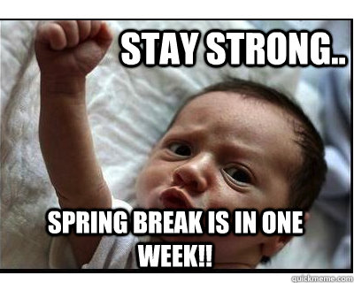

class: intro-slide

    

        <h2>CS 11114</h2>
        <h3>Introduction to Software Design</h3>
        <h4>Spring 2017 - Michael Irwin</h4>
    

    

        <h4><strong>Events/Reminders</strong></h4>
        

            Lab 6 this week 
            Program 3 has been posted
        

    

    

        
    

---
class: center, middle, inverse

## Let's go over Program 2!
