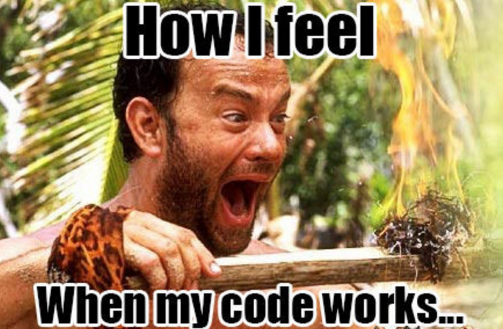

class: intro-slide

<div class="left">
    <div class="header">
        <h2>CS 1114</h2>
        <h3>Introduction to Software Design</h3>
        <h4>Spring 2017 - Michael Irwin</h4>
    </div>
    <div class="footer no-print">
        <h4><strong>Events/Reminders</strong></h4>
        <p>
            HW6 due Wed night<br />
            Lab 7 this week<br />
            Program 3 has been posted
        </p>
    </div>
</div>
<div class="right">
    <div class="meme">
        
    </div>
</div>

---
class: two-thirds-width-content

## Object References Step-by-Step

What's going on here?

```java
Jeroo bob = new Jeroo();
```

--

- `Jeroo bob` defines a new variable named `bob` that will reference anything of type `Jeroo`

<div style="position:absolute;background-color:#ccc;padding:15px;text-align:center;right:100px;top:200px;border:1px solid #333;color:black;width:180px;z-index:20;">Jeroo bob</div>

--

- `new Jeroo()` constructs a new `Jeroo` object.

<div style="position:absolute;background-color:orange;padding:15px;text-align:center;right:100px;top:400px;border:1px solid #333;color:black;width:180px;z-index:20;">Jeroo</div>

--

- `=` performs an assignment. It assigns the variable named `bob` to our new object.

<div style="position:absolute;background-color:black;width:2px;top:250px;right:185px;height:200px;z-index:10;"></div>

--
<br />
The _value_ for the variable `bob` is a reference to the object that was created.


---
class: two-thirds-width-content

## Object References

```java
Jeroo bob = new Jeroo();
bob.setGridX(5);
Jeroo jane = bob;
jane.setGridX(10);
System.out.println(bob.getGridX());
// What's printed out??
```

--

- `Jeroo bob = new Jeroo()` creates a new Jeroo

<div style="position:absolute;background-color:#ccc;padding:15px;text-align:center;right:100px;top:100px;border:1px solid #333;color:black;width:180px;z-index:20;">Jeroo bob</div>
<div style="position:absolute;background-color:orange;padding:15px;text-align:center;right:100px;top:300px;border:1px solid #333;color:black;width:180px;z-index:20;">Jeroo</div>
<div style="position:absolute;background-color:black;width:2px;top:150px;right:185px;height:200px;z-index:10;"></div>

--

- `bob.setGridX(5)` sets the x-coordinate for bob's object to 5
<div style="position:absolute;background-color:#ffc252;padding:0px 5px;text-align:center;right:110px;top:318px;color:black;z-index:25;">5</div>

--

- `Jeroo jane = bob` creates a new variable named `jane`, who points to `bob`

<div style="position:absolute;background-color:#ccc;padding:15px;text-align:center;right:100px;top:500px;border:1px solid #333;color:black;width:180px;z-index:20;">Jeroo jane</div>
<div style="position:absolute;background-color:black;width:2px;top:350px;right:185px;height:200px;z-index:10;"></div>


--

- `jane.setGridX(10)` sets the x-coordinate for jane's object to 10
<div style="position:absolute;background-color:#ffc252;padding:0px 5px;text-align:center;right:105px;top:318px;color:black;z-index:35;">10</div>


---

## Binky!

<div class="text-center">
    <iframe width="907" height="510" src="https://www.youtube.com/embed/vm5MNP7pn5g" frameborder="0" allowfullscreen style="margin:0 auto;"></iframe>
</div>


---

## Primitive Variables

```java
int a = 3;
int b = a;
a = 5;
System.out.println(b);
// What value is printed??
```

--

- Primitive variables don't store references, they store the actual value!

--

- `int a = 3` creates a new variable named `a`, type `int`, who gets a value of 3
- `int b = a` creates a new variable named `b`, type `int`, who gets the current value of `a`... 3.
- `a = 5` updates the value of a to 5
- `b` has remained unchanged

---
class: middle, center, inverse

## More on primitives...

---

## Primitive Types

- We've used a few different types of primitives so far...
  - `boolean` - has values of true or false
  - `int` - a whole number from (-2,147,483,648 to 2,147,483,647)
  - `String` - a collection of characters to make up text

--

- There are many others...
  - `byte` - a single byte number (ranges from -128 to 127)
  - `long` - number from -9 * 10^18 to 9 * 10^18
  - `char` - a single character (`char c = 'b'`)
  - `float` - a number that stores decimal places up to 7 significant digits
  - `double` - a number that stores decimal places up to 15 significant digits


---

## `int`'s in Action!

How about this one?

```java
int a = 7;
int b = 2;
int c = a / b;
// What value does c have?
```

--

- A variable named `a`, of type `int`, is created and given a value of 7.

--

- A variable named `b`, of type `int`, is created and given a value of 2.

--

- A variable named `c`, of type `int`, is created and given a value of `a / b`
  - Is it's value 3.5 or 3 or 4?

--

- `c` has a value of `3`!  Why?
   - `int` values are only whole numbers, not decimals. The decimal is simply dropped

---

## Keeping the Decimal

```java
double a = 7.0;
double b = 2.0;
double c = a / b;
// What value does c have?
```

- In this example, what value does `c` have?

--

- The `double` primitive keeps the decimal.  So, it has a value of 3.5!


---

## Mixing it up!

```java
int a = 7;
int b = 2;
double c = a / b;
```

- What value does `c` have now? 3.5? 3? 3.0?

--

- The answer is `3.0`!  WHAT?!?
  - Since the operation is `int / int`, the output is going to be an `int`, which is 3.
- To solve...
  1. Turn one of the `int` into a `double`
  2. Cast one of the `int` into a `double`<br />
     ```double c = (double) a / b;```


---

## The modulo operator

- The modulo operator (`%`) gives the remainder after a division operation

```java
int a = 7;
int b = 3;
int c = a % b;
System.out.println(c);
// What's the value of c??
```

--

- The operation of `7 / 3` has a remainder of 1, so `c` has a value of 1!