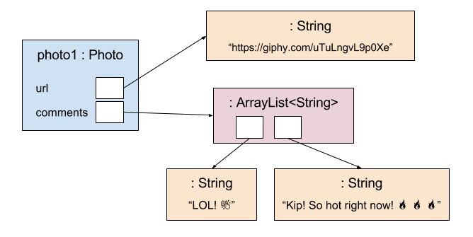
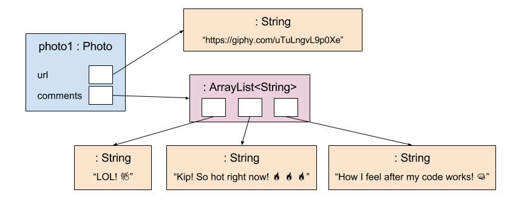
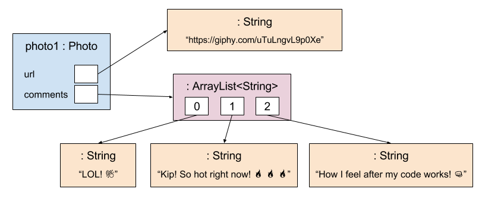
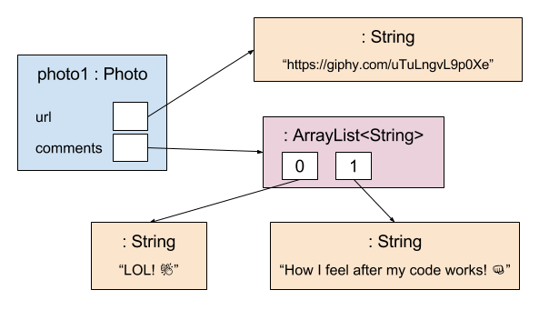

class: intro-slide

<div class="left">
    <div class="header">
        <h2>CS 1114</h2>
        <h3>Introduction to Software Design</h3>
        <h4>Spring 2017 - Michael Irwin</h4>
    </div>
    <div class="footer no-print">
        <h4><strong>Events/Reminders</strong></h4>
        <p>
            Program 3 due Thursday<br />
            Lab 08 this week<br />
            No homework this week
        </p>
    </div>
</div>
<div class="right">
    <div class="meme">
        
    </div>
</div>

---
class: middle, center, inverse

## How's Program 3?

---

## Introducing Interfaces

- An **interface** is NOT a class - only defines required methods
- Contains _only method signatures and constants_
  - No constructors. No method bodies
- Any class that **implements** an interface is required to define the method bodies of the interface
- You cannot create an instance of an interface - only classes that implement the interface

---

## Interface Example

You don't need to know how to create interfaces yet, but here's an example...

```java
public interface Paintable {
    void paint(Color color);
}
```

And two implementations...

```java
public class Cube implements Paintable {                  public class Table implements Paintable {
    public void paint(Color color) {                          public void paint(Color color) {
        this.left = color;                                         this.tableTop = color;
        this.right = color;                                        this.legs = color;
        this.back = color;                                    }
        this.front = color;                               }
        this.top = color;
        this.bottom = color;
    }
}

```


---

## Java's collection interfaces

- List (`java.util.List`)
  - Keeps items in a sequential order - allows you to get the `nth` item
  - Allows multiple entries of the same item
- Set (`java.util.Set`)
  - Generally, not kept in sequential order
  - Does not allow duplicates
  - Not going to cover in this course
- Map (`java.util.Map`)
  - Key-value collection - items are stored with a name. Allows retrieval using the name
  - Duplicate values allowed, but each name exists at most once
  - Will cover in a few weeks


---

## Lists

- Keeps a group of zero or more objects as if they were arranged in a line
- The group can grow or shrink as you **add** and **remove**
- Positions start at index 0
- Main methods introduced by List interface
  - `boolean add(Object o);`
  - `int size();`
  - `Object get(int index);`
  - `Object remove(int index);`
- The "go to" implementation is `ArrayList`


---

## Example

```java
public class Photo {
    private String url;
    private List<String> comments;

    public Photo() {
        this.comments = new ArrayList<String>();
    }
}
```

- Notice that comments is using a `List`, which is an interface
- `<String>` is using a feature of Java called generics
  - Simply says that things going in and out of the list are of type `String`
  - Won't dive much into generics in this course
- `new ArrayList<String>()` creates the actual list and assigns it to `comments`


---

## Object References with an ArrayList

<div class="text-center">
    
</div>


---

## Adding a third file

```java
comments.add("How I feel after my code works! 👊");
```

<div class="text-center">
    
</div>


---

## Updating the `Photo` class

```java
public class Photo {
    private List<String> comments;
    ...

    public void addComment(String comment) {
        comments.add(comment);
    }

    public int getNumberOfComments() {
        return comments.size();
    }
}
```

---

## Index Numbering

- Accessing elements in a list uses indexes
- First item is found at index 0 (not 1!)
- Think of indexes as offsets from the beginning
  - To get second item, you need the item offset 1 from the beginning
  - `comments.get(1);`

<div class="text-center">
    
</div>

---

## Retrieving an item from the list

- `Object get(index)` - returns the item found at the specified index
- **CAUTION** - ensure that index is a valid index number
  - If the number is not valid, you will get an exception (most likely `ArrayIndexOutOfBoundsException`)
  - Valid numbers range from 0 to list size - 1


---

## Removing items from list

- **Important** - removing renumbers all elements after removed item

```java
comments.remove(1);
```

<div class="row">
    <div class="col-md-6 text-center">
        
    </div>
    <div class="col-md-6 text-center">
        
    </div>
</div>

- Notice that what was at index 2 is now at index 1

---
class: right-align-code-block, code-mt-0 

## Iterating through collections using for-each loops

```java
public void listAllComments() {
    for (String comment : comments) {
        System.out.println(comment);
    }
}
```

- There are multiple ways to iterate through collections
- The for-each loop is most frequently seen
- Pros
  - Easiest to write
  - Terminates automatically (no infinite loops)
- Cons
  - Can't modify list while looping (`ConcurrentModificationException`)
  - Index not available


---

## Searching within a list

- Two approaches to find an element - immediate return or breaking

```java
public String findComment(String searchString) {         public String findComment(String searchString) {
    for (String comment : comments) {                        String target = null;
        if (comment.contains(searchString)) {                for (String comment : comments) {
            return comment;                                      if (comment.contains(searchString)) {
        }                                                            target = comment;
    }                                                                break;
    return null;                                                 }
}                                                            }
                                                             return target;
                                                         }   
```
