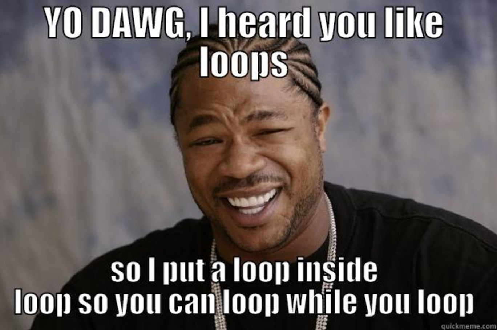
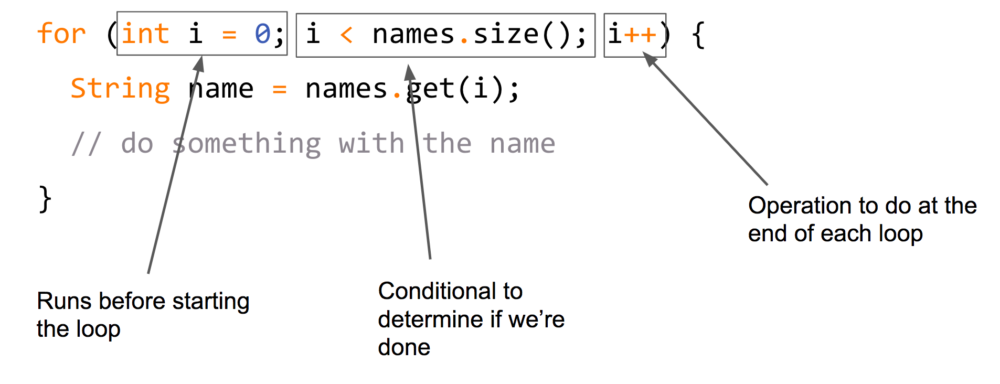

class: intro-slide

<div class="left">
    <div class="header">
        <h2>CS 1114</h2>
        <h3>Introduction to Software Design</h3>
        <h4>Spring 2017 - Michael Irwin</h4>
    </div>
    <div class="footer no-print">
        <h4><strong>Events/Reminders</strong></h4>
        <p>
            Program 3 due Tomorrow!<br />
            Lab 08 this week<br />
            No homework this week
        </p>
    </div>
</div>
<div class="right">
    <div class="meme">
        
    </div>
</div>

---
class: middle, center, inverse

## How's Program 3?

---

## Program 3 Notes

- The `act()` method should only perform one action
  - If your Greep goes from the tomato patch to the ship in a single act(), you’re doing it wrong
  - Makes it much easier to debug issues since you can see what’s going on
  - If a Greep gets stuck, others can still make progress

---
class: inline-code-blocks

## Idioms

- Represent a `conventional` way/pattern of structuring code
  - Programmers use them `by habit`
- They help you understand code written by others
- They help prevent errors

<br />
Example below... swapping the values `a` and `b` in three different languages

```java
// Java
temp = a;
a = b;
b = temp;
```

```perl
# Perl
($a, $b) = ($b, $a);
```

```python
# Python
a, b = b, a
```

---

## For-each reminder

- Used when iterating through a collection (List, Sets, etc.)
- The loop is executed once for every element in the collection

```java
List<String> names = new ArrayList<String>();
names.add("Bob");
names.add("Sally");

for (String name : names) {
  System.out.println("Hi " + name + "!");
}

// Prints out:
//   "Hi Bob!"
//   "Hi Sally!"
```

---

## Many loops to do the same thing

- Another construct to do looping
- All three loops below are equivalent, but structured very differently.

```java
for (int i = 0; i < names.size(); i++) {
  String name = names.get(i);
  System.out.println("Hi " + name + "!");
}
                                                       for (String name : names) {
                                                         System.out.println("Hi " + name + "!");
int i = 0;                                             }
while (i < names.size()) {
  String name = names.get(i);
  System.out.println("Hi " + name + "!");
  i++;
}
```

---

## Breaking down the `for` loop

<div class="col-xs-10 col-xs-offset-2" style="margin-top:50px;">
  
</div>


---

## Problem #1

Write a for loop that calculates the sum of all numbers between 1 and N.

Examples: 
- `sumOneToN(5)` => 15
- `sumOneToN(7)` => 28

---

## Problem #2

Write a loop that, when given a list of Strings, finds the first item that matches a substring. If no match is found, return `null`.

Examples: 
- Using a list containing elements "Virginia Tech", "UVA", and "Duke"
  - `findFirstOccurrence(list, "uk")` => "Duke"
  - `findFirstOccurrence(list, "e")` => "Virginia Tech"
  - `findFirstOccurrence(list, "zz")` => null

---

## Problem #3

Write a loop that, when given a list of Strings, finds the last item that matches a substring. If no match is found, return `null`.

Examples: 
- Using a list containing elements "Virginia Tech", "University of Virginia", and "Virginia Commonwealth University"
  - `findLastOccurrence(list, "irginia")` => "Virginia Commonwealth University"
  - `findLastOccurrence(list, "T")` => "Virginia Tech"
  - `findLastOccurrence(list, "zz")` => null


---

## Problem #4

- Given a List of positive numbers, find the largest number. If the list is empty, return -1.

Examples
- Given the list 2, 7, 3, 9, 1
  - `findLargest(list)` => 9

---

## Problem #5

- Given a List of numbers, calculate the average as an integer. If the list is empty, return 0.

Example:
- Given the list 2, 7, 3, 7, 1
  - `findAverage(list)` => 4

---

## Recap/Review

- **Use the idioms** (patterns) if possible
- Think about the **role** of each variable (do you need each of them?)
  - Accumulator, index, constant, etc.
- Always consider what happens if the loop does not repeat at all
  - Empty list, zero or negative limit, empty string, no matches found, etc.
- Ask yourself: should the loop end early?
  - Use `return`, if method ends too
  - Use `break`, if method has more work to do (must save result in a local variable, too)

